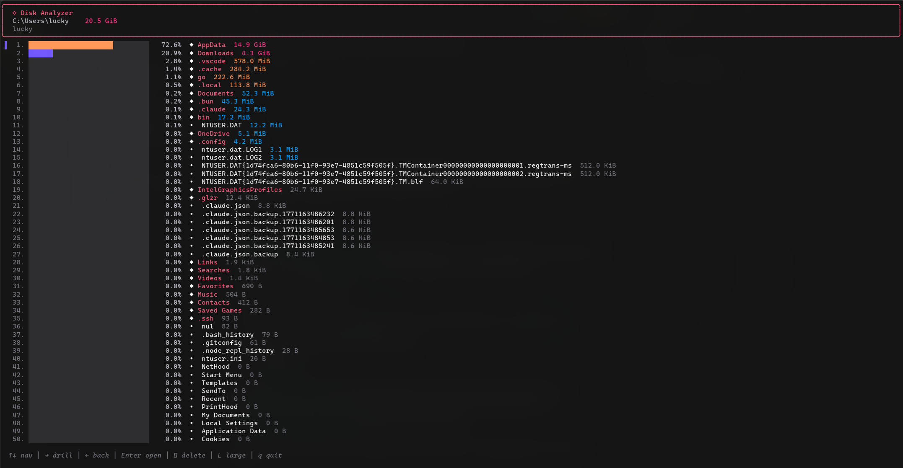
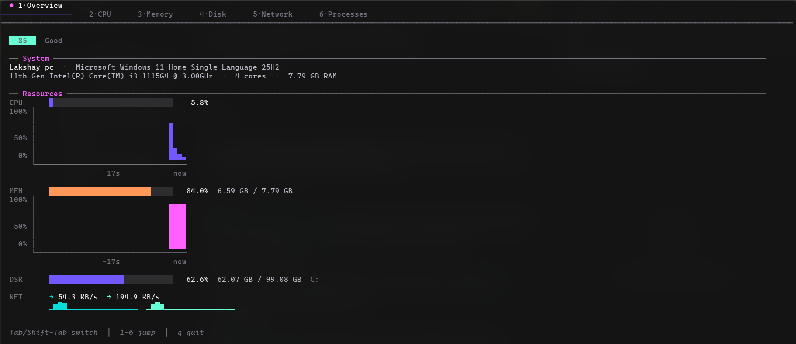
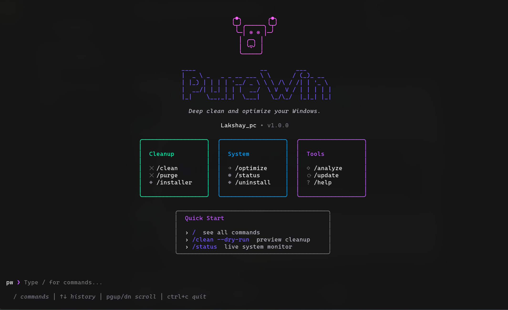
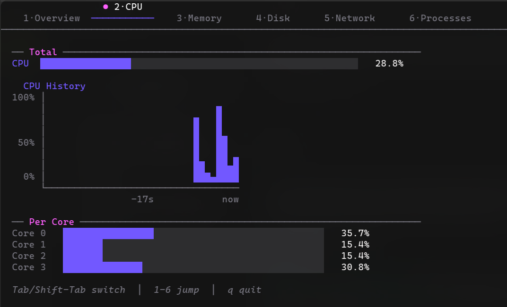

<p align="center">
  
</p>

<h1 align="center">PureWin</h1>

<p align="center"><strong>Your Windows, purified.</strong></p>

<p align="center">
  <a href="https://github.com/lakshaymaurya-felt/purewin/actions/workflows/ci.yml"></a>
  <a href="https://github.com/lakshaymaurya-felt/purewin"></a>
  <a href="https://opensource.org/licenses/MIT"></a>
</p>

```
    ╭●╮       ╭●╮
    ╰┬╯╭─────╮╰┬╯
     ╰─│ ◉ ◉ │─╯
       │ ╭─╮ │
       │ ╰▽╯ │
       ╰─────╯
```

---

## What is PureWin?

**PureWin** is the definitive Windows optimization toolkit. Built from the ground up in pure Go, it delivers blazing-fast system cleanup, surgical app removal, real-time monitoring, and performance optimization in a single, dependency-free binary.

Forget bloated GUI tools that slow you down. PureWin gives you a beautiful terminal interface that's faster, more powerful, and infinitely more satisfying to use. Whether you're reclaiming gigabytes of wasted disk space, hunting down stubborn leftover files, or monitoring system health in real-time, PureWin handles it with surgical precision.

Native. Fast. Uncompromising. This is Windows optimization done right.

---

## Preview

<p align="center">
  
  <br />
  <em>Welcome screen with mascot, command cards, and quick-start tips</em>
</p>

<p align="center">
  
  <br />
  <em>Interactive shell with slash-command autocomplete</em>
</p>

<p align="center">
  
  <br />
  <em>Real-time system overview — health score, CPU, memory, disk, and network at a glance</em>
</p>

<p align="center">
  
  <br />
  <em>Per-core CPU monitoring with live history charts</em>
</p>

<p align="center">
  
  <br />
  <em>Interactive disk space analyzer — drill into directories, sort by size, delete on the spot</em>
</p>

---

## Features

- **× Deep System Cleanup** — Obliterate temp files, caches, logs, browser data, and dev tool artifacts
- **× Complete App Removal** — Uninstall apps and wipe their registry entries, configs, and hidden remnants
- **◇ Disk Space Analysis** — Interactive treemap visualization that shows exactly where your storage went
- **→ System Optimization** — Refresh caches, restart services, optimize performance with one command
- **● Real-Time Monitoring** — Live dashboard tracking CPU, memory, disk, network, GPU, and battery
- **◆ Installer Cleanup** — Hunt down and remove orphaned .exe, .msi, .msix files lurking in Downloads
- **× Dev Tool Cleanup** — Purge build artifacts from node_modules, target/, .gradle, .nuget, and more
- **◈ Safety First** — Whitelist protection, dry-run mode, and NEVER_DELETE safeguards for critical paths
- **◇ Beautiful TUI** — Rich interactive menus powered by Bubble Tea that make cleanup feel like a game
- **○ Self-Updating** — Check for and install updates directly from GitHub releases
- **→ PowerShell Completion** — Tab completion for all commands
- **› Interactive Shell** — Persistent shell with slash-command autocomplete for power users

---

## Quick Install

### Via Go Install
```bash
go install github.com/lakshaymaurya-felt/purewin@latest
```

### Via PowerShell (one-liner)
```powershell
irm https://raw.githubusercontent.com/lakshaymaurya-felt/purewin/main/scripts/install.ps1 | iex
```

### Via GitHub Releases
Download the latest `.zip` from [Releases](https://github.com/lakshaymaurya-felt/purewin/releases), extract `pw.exe`, and add to your PATH.

---

## Usage

### Interactive Menu
Launch the full-screen interactive menu:

```bash
pw
```

Navigate with arrow keys, select with Enter, and watch PureWin work its magic.

### Direct Commands
Run specific operations directly:

```bash
# Preview what will be cleaned (safe mode)
pw clean --dry-run

# Clean everything (requires admin for system caches)
pw clean --all

# Clean only browser caches
pw clean --browser

# Uninstall an app completely
pw uninstall

# Analyze disk usage with visual treemap
pw analyze C:\

# Monitor system health in real-time
pw status

# Remove orphaned installer files
pw installer

# Optimize system performance
pw optimize

# Clean dev tool build artifacts
pw purge

# Update PureWin to latest version
pw update

# Show version info
pw version
```

---

## Commands Reference

| Command      | Description                                                  | Admin Required |
|--------------|--------------------------------------------------------------|----------------|
| `clean`      | Deep cleanup of caches, logs, temp files, browser leftovers | Partial*       |
| `uninstall`  | Remove apps completely with registry and leftover cleanup   | Yes            |
| `analyze`    | Interactive disk space analyzer with visual tree view       | No             |
| `optimize`   | Refresh caches, restart services, optimize performance      | Yes            |
| `status`     | Real-time dashboard for CPU, memory, disk, network, GPU     | No             |
| `installer`  | Find and remove installer files (.exe, .msi, .msix)         | No             |
| `purge`      | Clean project build artifacts (node_modules, target/, etc.) | No             |
| `update`     | Check for and install latest PureWin version                | No             |
| `remove`     | Uninstall PureWin and remove config/cache                   | No             |
| `completion` | Generate PowerShell tab completion                          | No             |
| `version`    | Show installed version                                      | No             |

*`clean --system` requires admin; `--user`, `--browser`, `--dev` do not.

---

## Safety

PureWin is engineered with safety as the foundation:

### NEVER_DELETE Protection
Critical system paths are hardcoded as off-limits. PureWin will refuse to touch:
- `C:\Windows`
- `C:\Program Files`
- `C:\Program Files (x86)`
- User profile root directories

### Whitelist System
Protect specific caches you want to keep:
```bash
pw clean --whitelist
```
Whitelisted items are persisted in your config and skipped during cleanup.

### Dry-Run Mode
Preview exactly what will be deleted before committing:
```bash
pw clean --dry-run
```
Enable persistent dry-run mode in config:
```toml
# Edit %LOCALAPPDATA%\purewin\config.toml
dry_run = true
```

### Clear Confirmation Prompts
Every destructive operation requires explicit user confirmation with detailed previews. No surprises.

---

## Building from Source

```bash
git clone https://github.com/lakshaymaurya-felt/purewin.git
cd purewin
go build -o pw.exe .
```

### Build with Version Info
```bash
go build -ldflags="-X github.com/lakshaymaurya-felt/purewin/cmd.appVersion=1.0.0" -o pw.exe .
```

---

## Configuration

PureWin stores its config at `%LOCALAPPDATA%\purewin\config.toml`:

```toml
# Enable persistent dry-run mode (preview only, never delete)
dry_run = false

# Whitelisted caches (never cleaned)
whitelist = [
    "C:\\Users\\You\\AppData\\Local\\SomeApp\\cache"
]

# Auto-update check interval (hours)
update_check_interval = 24
```

---

## License

[MIT](LICENSE) — Free to use, modify, and distribute.

---

## Contributing

Contributions, issues, and feature requests are welcome! Feel free to open an issue or submit a PR. Let's make Windows optimization better together.

---

**Built for Windows users who refuse to settle for bloat.**
